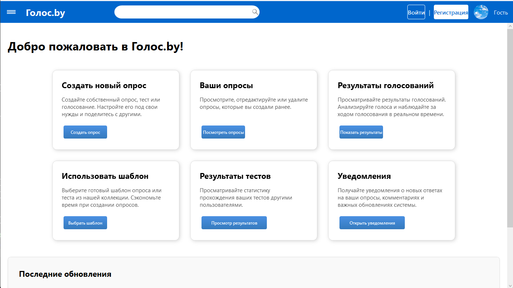
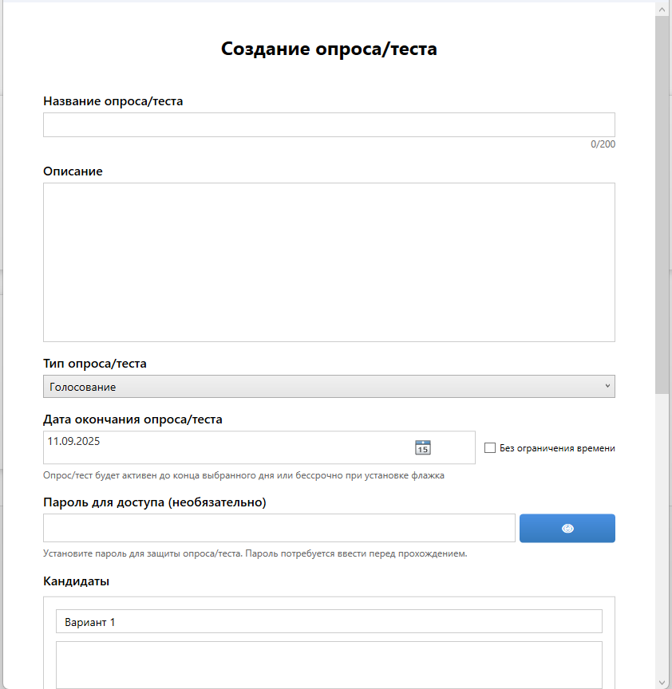
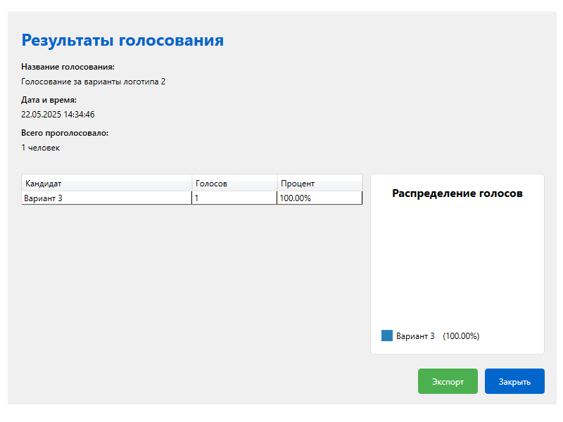

# Project_Vote

## 📋 Table of Contents

- [Features](#-Features)
- [Technologies](#-Technologies)
- [Installation](#-Installation)
- [Usage](#-Usage)
- [Screenshots](#-Screenshots)

## ✨ Features

- Create polls and voting
- Anonymous and public voting
- Real-time results generation
- Results export
- Multi-user mode

## 🛠 Technologies

- **WPF, SQL,:** 

## 📦 Installation

# 1. Download the repository and navigate to the project directory

# 2. Set up a database connection using MySQL code

# 3. Install dependencies and start the application
npm install
npm start

## Usage

1. **Sign up or sign in**

- Create a new account using your email address, password confirm email address
- Or sign in using your existing credentials

2. **Create a new poll by clicking the "Create" button**
- Go to your dashboard
- Click the "Create a new poll" button
- Select a poll type

3. **Configure your poll/test settings**
- Choose between public (visible to voters) or anonymous voting
- Set the start and end dates of the voting period
- Configure additional settings such as multiple choice or single vote

4. **Share the link with participants**
- Copy the unique voting link from the poll you created
- Share it via email, messengers or social media
- Track participation via your dashboard

5. **View results in real time**
- Keep track of votes coming in with real-time updates
- View detailed analytics and statistics
- Export results in various formats (CSV, PDF) for further analysis

## 📸 Screenshots

### Home page

*The main page of the application with a list of active votes*

### Create a poll

*Form for creating a new vote*

### Results

*Real-time voting results page*
